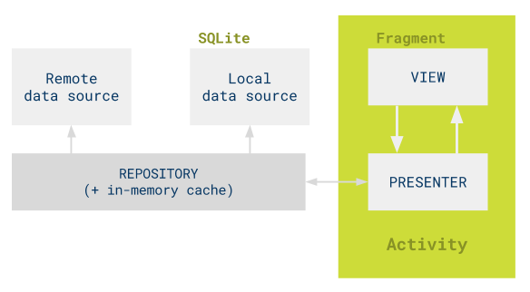
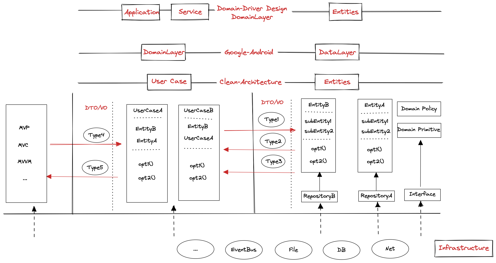
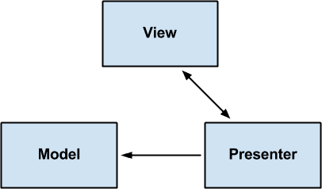

# 前提

MVC、MVP、MVVM、Clean Architecture 等都只是设计思想，并不是代码框架。

MVC，MVP，MVVM 是针对 GUI（用户界面）的设计模式，所以它们仅仅作为项目完整架构中的一环，而不是全部。

# android-architecture-todoapp-mvp

Google官方推荐的Android框架MVP例子，自己添加了一些注释和理解。

基于 Model View Presenter的架构模式，核心思想如下图所示：

此项目的MVP分工：

- Model

  指整个DataLayer层（这里为 REPOSITORY+Task），不是单指某个类。由于Task为Immutable类型所以即使View直接持有它也不会有问题，不会对业务逻辑有任何影响（也可以认为View没有持有Model，这里这么做只是为了简化，减少不必要的类型转换，对于复杂需求View一般会有一个自己的属性类，Presenter负责将Model转换为View的属性对象）。

- View

  Android的用户界面，负责处理与用户的交互、View渲染以及动画等UI相关逻辑，持有Presenter，通过调用Presenter的方法来获取展示的数据。

- Presenter 

  持有Repository和View（两者通过构造函数进行注入），被View调用后从Repository中读取数据（Model），然后更新View的显示。一般不包含任何业务逻辑，它所做的那部分仅仅是将业务数据转换为View能够识别的数据，在本示例中，并没有单独设计一个View属性类（类似ViewModel的类），直接将Repository返回的Model设置给了View，因为Model是Immutable类型，所以不必担心View持有Model会带来问题（可以认为View没有持有Model）。

源码来自：
https://github.com/android/architecture-samples/tree/todo-mvp

# android-architecture-todoapp-mvp-clean

## Clean Architecture

首先看一个[Clean Architecture构想图](https://blog.cleancoder.com/uncle-bob/2012/08/13/the-clean-architecture.html)：

最重要的是依赖规则，一定要从外向内进行依赖，最内圈Entities不依赖任何外部类，实现所有业务逻辑，最终做到业务逻辑与依赖细节实现完全解藕。

简单说明下各个圈的职责：

- Entities 

  纯java对象（POJO类），**可以是具有方法的对象，也可以是一组数据结构和函数**这并不重要，只要实体可以被企业中的许多不同应用程序使用就行。如果只是编写一个简单的程序，这些实体就是应用程序的业务对象。封装了最通用和最高级的规则。当外部事物发生变化时，它们最不可能发生变化。

- User Cases 

  收敛or组合Entities，转换出当前App需要的数据，当然如果有一个Entities能够完全匹配你的App，那么直接拿来用也可以。

- Interface Adapters 

  负责将User Case输出的数据转换为外部接收模块能够识别的数据格式，例如，UI展示需要的数据等。完整GUI架构MVC，MVP，MVVM都位于此层，**它们中的Model可以理解为从Controller传递到UserCase层或者从UserCase层传递到Presenter/View层的数据结构，在Uncle Bob博客中是这么解释的，并没有将UserCase+Entites看作GUI架构的整个Model**。

- Frameworks and Drivers

  负责与“固件”打交道，它们完全与当前运行环境、三方框架等强绑定，它有两层含义：

  - 负责实现内圈的抽象细节，例如：数据库存储，网络存储，线程池等。
  - 负责内圈业务数据的展示与接受业务输入（UI）。

是不是只能四个圈？

不是，上图的圈只是一个示意，没有规则说只能有四个圈。在你实际开发中可能不仅仅只有这四个圈。但是，依赖规则始终适用。 源代码依赖项总是指向内部。 随着您向内移动，抽象级别会增加。 最外圈是低层次的具体细节。 随着您向内移动，软件变得更加抽象，并封装了更高级别的策略。 最内圈是最简单的java类（POJO类）。

上面只是一个架构指导思想，那么具体到代码实现应该怎么实现呢？
下图是一个设计图：

**各个层级之间采用Dependency Inversion Principle（依赖倒置原则）来结合**。

**针对此图要额外多说下GUI架构（MVC、MVP、MVVM）中的Model对应于上图中的`Type1`、`Type2`、`Type3`、`Type4`、`Type5`**。

### GUI Layer

这一层是处理UI逻辑的地方，使用了MVP（Model View Presenter）模式， 你也可以使用 MVC、MVVM。

在这里 Activity和Fragment都是Views，不处理除UI逻辑之外的任何逻辑，View的渲染操作都在这里完成。

在这一层 Presenters 调用/组合UserCase来获取Model然后转换成View所需的属性最后设置给View。有时候为了简便会直接将Model设置给View，来让View自己根据Model设置显示内容，Presenters从UserCase获取到的数据一般都是Immutable类型，所以不必担心View持有Model带来的问题（可以认为View没有持有Model）。

### Domain Layer

不包含任何框架代码，仅包含简单的java类，与平台，固件，环境，框架完全无关。

我们按照Google-Android给出的架构模式来看。

这层包含各种UserCase，其实就是封装了下DataLayer层来针对APP开发出APP所需的API，对于一些简单APP可以去掉这一层。

### Data Layer

最高层，同样不包含任何框架代码，仅包含简单的java类，与平台，固件，环境，框架完全无关。

通过依赖倒置来隔离此层与具体的数据存储细节代码（数据库，网络等），具体来说就是只依赖自己抽象出来的Repository接口，让调用方来进行具体的Repository依赖注入（注入这一步应该在GUILayer做）。

## PS

MVP只是整个项目架构中的一环，相对于android-architecture-todoapp-mvp，这里额外增加了UserCase层，简单点来说就是相对于 android-architecture-todoapp-mvp 区别就是两者的业务处理层不同：

- android-architecture-todoapp-mvp 业务层只有数据层（DataLayer）：Repository。
- android-architecture-todoapp-mvp-clean 业务层为领域层+数据层（DomainLayer+DataLayer）：UserCase+Repository。

Github代码示例：

[Android官方示例](https://github.com/android/architecture-samples/tree/todo-mvp-clean)

[Android10示例](https://github.com/android10/Android-CleanArchitecture)

其实不用死搬硬套这些个模式，关键是做到**分离关注点（在合适类中做合适的工作，例如在Activity中就应该仅仅进行UI相关操作），代码模块间的低耦合，模块内的高内聚。如果你能不采用这些架构思想做到这一点也可以**。
